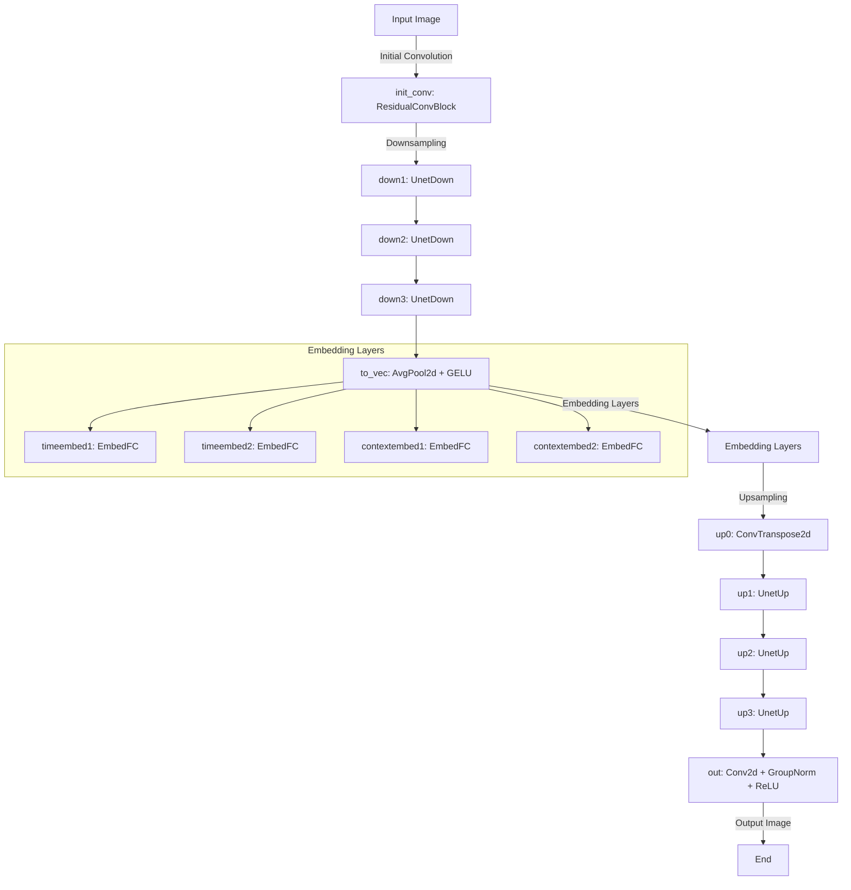

 
# Robo Khutt (خط)
Where Tradition Meets Technology
[العربي](./README_ar.md)


Robo Khutt is an innovative project that leverages advanced diffusion models to generate high-quality Arabic calligraphy. By combining the artistry of traditional calligraphy with the power of artificial intelligence, RoboKhutt aims to provide beautifully rendered text that can be used in various applications.

The project is called "RoboKhutt" to reflect its focus on text rendering and calligraphy and AI Automation. The name combines "Robo" for AI / robotics and "Khutt" the Arabic (خط) word for calligraphy

## Problem Statement
In traditional text rendering, we often encounter challenges with laying out text properly or finding suitable substitutions for certain characters or words. As a fun and ambitious solution, I propose training a diffusion model to become a calligrapher! However, recognizing the enormity of this task, I plan to take an incremental approach.

## Approach
My approach involves training a model to render small sentences or even single words initially. At runtime, the rendered image will be used to feed the diffusion model. This approach allows us to start with simpler tasks and gradually scale up to more complex text generation.

## Limitations
- **Image Dimensions**: The generated images will be 512x128 pixels.
- **Maximum Word Length**: Given the constraints of the image dimensions and the average character width (approximately 20 pixels), the model is designed to handle words up to 20-25 characters in length.
- **Character Adaptability**: The model adapts to varying character widths and different calligraphy styles and fonts, ensuring optimal readability and aesthetic quality.

## Additional Notes
I'm excited about the potential of this project to merge the elegance of Arabic calligraphy with the power of modern AI. Any feedback or contributions to further enhance RoboKhutt are welcome!

## Features

- **Text-to-Image Generation**: Convert Arabic text into stunning calligraphic images.
- **Customizable Styles**: Supports various calligraphy styles and fonts.
- **Incremental Learning**: Starts with individual characters and scales up to words and sentences.
- **High-Quality Output**: Utilizes state-of-the-art diffusion models to ensure visually appealing results.


## UNet Implementation in ContextUnet

The UNet architecture in the ContextUnet implementation consists of multiple layers, forming a characteristic "U" shape. It starts with an initial convolution block, followed by three downsampling layers, a bottleneck layer, and then proceeds with four upsampling layers to restore the spatial dimensions of the input image. Embedding layers are also included to incorporate time and context information.

### Detailed Breakdown of Layers and Steps

1. **Initial Convolution:**
   - `init_conv`: ResidualConvBlock

2. **Downsampling Path (Encoder):**
   - `down1`: UnetDown (64 -> 128 channels)
   - `down2`: UnetDown (128 -> 256 channels)
   - `down3`: UnetDown (256 -> 512 channels)

3. **Bottleneck Layer:**
   - `to_vec`: AvgPool2d + GELU

4. **Embedding Layers:**
   - `timeembed1`: EmbedFC (1 -> 512 channels)
   - `timeembed2`: EmbedFC (1 -> 256 channels)
   - `contextembed1`: EmbedFC (n_cfeat -> 512 channels)
   - `contextembed2`: EmbedFC (n_cfeat -> 256 channels)

5. **Upsampling Path (Decoder):**
   - `up0`: ConvTranspose2d + GroupNorm + ReLU (512 channels)
   - `up1`: UnetUp (512 -> 256 channels)
   - `up2`: UnetUp (256 -> 128 channels)
   - `up3`: UnetUp (128 -> 64 channels)

6. **Output Convolution:**
   - `out`: Conv2d + GroupNorm + ReLU + Conv2d (128 -> 3 channels, for RGB output)



## Summary of the Hyperparameters in RoboKhutt Implementation

### ContextUnet Hyperparameters
- `in_channels`: Number of input channels in the images (typically 3 for RGB images).
- `n_feat`: Number of features for the convolution layers (default is 64).
- `n_cfeat`: Number of context features (default is 10).
- `height`: Height of the input images (default is 128).

### ResidualConvBlock Hyperparameters
- `in_channels`: Number of input channels.
- `out_channels`: Number of output channels.
- `is_res`: Boolean indicating whether the block is a residual block (default is `False`).

### UnetDown Hyperparameters
- `in_channels`: Number of input channels.
- `out_channels`: Number of output channels.

### UnetUp Hyperparameters
- `in_channels`: Number of input channels.
- `out_channels`: Number of output channels.

### EmbedFC Hyperparameters
- `input_dim`: Dimensionality of the input.
- `emb_dim`: Dimensionality of the embedding.

### TextImageDataset Hyperparameters
- `alphabet`: List of characters representing the alphabet.
- `max_length`: Maximum length of the generated text strings.
- `font_name`: Name of the font to be used for rendering text images.
- `font_size`: Size of the font.
- `image_size`: Size of the generated images (tuple of width and height).
- `is_arabic`: Boolean indicating whether the text is Arabic (default is `False`).

### Diffusion Model Training Hyperparameters
- `epochs`: Number of training epochs.
- `device`: Device used for training (CPU or GPU).
- `save_path`: Path to save the trained model.
- `learning_rate`: Learning rate for the optimizer (default is `1e-3`).

### Utilities Hyperparameters

#### render_text_image
- `text`: Text to be rendered on the image.
- `image_size`: Size of the image (tuple of width and height).
- `font_name`: Name of the font.
- `font_size`: Size of the font.
- `position`: Position to align the text (e.g., 'top-left', 'center').
- `is_arabic`: Boolean indicating whether the text is Arabic (default is `False`).

## Project Structure


## Getting Started

### Prerequisites

- Python 3.8+
- PyTorch
- Hugging Face Transformers
- PIL (Pillow)
- Other dependencies listed in `requirements.txt`

### Installation

1. Clone the repository:
```bash
   git clone https://github.com/your_username/RoboKhutt.git
   cd RoboKhutt
```

Dependencies
```
```

2. Create a virtual environment and activate it:
```bash
python -m venv venv
source venv/bin/activate  # On Windows, use `venv\Scripts\activate`
```

3. Install the dependencies:

```bash
pip install -r requirements.txt
```

Running tests
```
python -m unittest discover
python -m unittest discover -s tests -p "test_lang_utilities.py"
python -m unittest discover -s tests -p "test_diffusion_utilities.py"
or
set PYTHONPATH=%CD%\src;%CD%
set PYTHONIOENCODING=utf-8
set LOGGING_LEVEL=DEBUG

pip install -e .

pytest

taskkill /F /IM python.exe /T

```

### Usage

#### Data Preparation:

Collect a dataset of Arabic text and corresponding images.
Use provided scripts in the `scripts/` directory to preprocess the data.
#### Training:

Train the diffusion model on your dataset using:
```bash
Copy code
python src/model_training.py --data_dir path_to_your_data --output_dir path_to_save_model
```

#### Inference:

Generate calligraphic images from text using:
```bash
Copy code
python src/model_inference.py --input_text "Your Arabic Text Here" --model_dir
```
