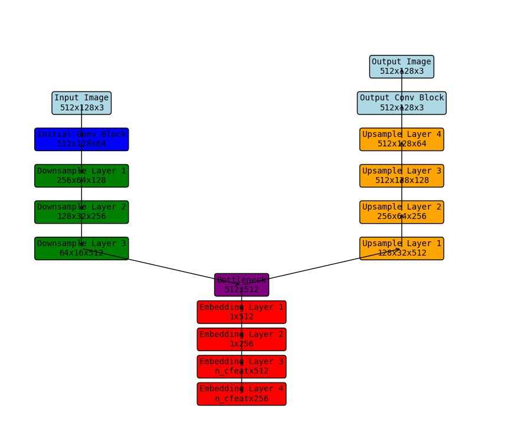

# روبو خط (Robo Khutt)
حيث تلتقي التقاليد بالتكنولوجيا
[English](./README.md)

روبو خط هو مشروع مبتكر يستفيد من نماذج الانتشار المتقدمة لتوليد الخط العربي بجودة عالية. من خلال دمج فن الخط التقليدي بقوة الذكاء الاصطناعي، يهدف RoboKhutt إلى توفير نصوص مرسومة بشكل جميل يمكن استخدامها في تطبيقات مختلفة.

تم تسمية المشروع بـ "RoboKhutt" ليعكس تركيزه على رسم النصوص والخط والذكاء الاصطناعي. يجمع الاسم بين "Robo" للإشارة إلى الذكاء الاصطناعي / الروبوتات و"Khutt" الكلمة العربية للخط.

## مشكلة المشروع
في عملية رسم النصوص التقليدية، نواجه غالبًا تحديات في تنسيق النصوص بشكل صحيح أو إيجاد بدائل مناسبة لبعض الأحرف أو الكلمات. كحل ممتع وطموح، أقترح تدريب نموذج انتشار ليصبح خطاطًا! ومع ذلك، نظراً لضخامة هذه المهمة، أخطط لاتخاذ نهج تدريجي.

## النهج المتبع
يتضمن النهج الخاص بي تدريب نموذج لرسم الجمل الصغيرة أو حتى الكلمات الفردية في البداية. في وقت التشغيل، سيتم استخدام الصورة المرسومة لتغذية نموذج الانتشار. يسمح لنا هذا النهج بالبدء بالمهام الأبسط وتدريجياً توسيع نطاق المهمة لتوليد النصوص الأكثر تعقيدًا.

## القيود
- **أبعاد الصورة**: ستكون أبعاد الصور المولدة 512x128 بكسل.
- **الحد الأقصى لطول الكلمة**: نظرًا لقيود أبعاد الصورة ومتوسط عرض الحرف (حوالي 20 بكسل)، تم تصميم النموذج للتعامل مع الكلمات التي يصل طولها إلى 20-25 حرفًا.
- **قابلية تكيف الحرف**: يتكيف النموذج مع أحجام الحروف المختلفة وأنماط الخط المختلفة، مما يضمن القراءة المثلى والجودة الجمالية.

## ملاحظات إضافية
أنا متحمس لإمكانية هذا المشروع في دمج أناقة الخط العربي بقوة الذكاء الاصطناعي الحديث. أي ملاحظات أو مساهمات لتحسين RoboKhutt مرحب بها!

## الميزات

- **تحويل النص إلى صورة**: تحويل النص العربي إلى صور خطية مذهلة.
- **أنماط قابلة للتخصيص**: يدعم أنماط الخطوط المختلفة.
- **التعلم التدريجي**: يبدأ بالأحرف الفردية ثم يتوسع إلى الكلمات والجمل.
- **مخرجات عالية الجودة**: يستخدم نماذج انتشار حديثة لضمان نتائج بصرية جذابة.

## تنفيذ UNet في ContextUnet

يتكون هيكل UNet في تنفيذ ContextUnet من طبقات متعددة، مكونة شكل "U" المميز. يبدأ بكتلة التفاف ابتدائية، يليها ثلاث طبقات خفض، ثم طبقة عنق الزجاجة، ويستمر بأربع طبقات رفع لاستعادة الأبعاد المكانية للصورة المدخلة. تشمل الطبقات أيضًا طبقات تضمين لدمج معلومات الوقت والسياق.

