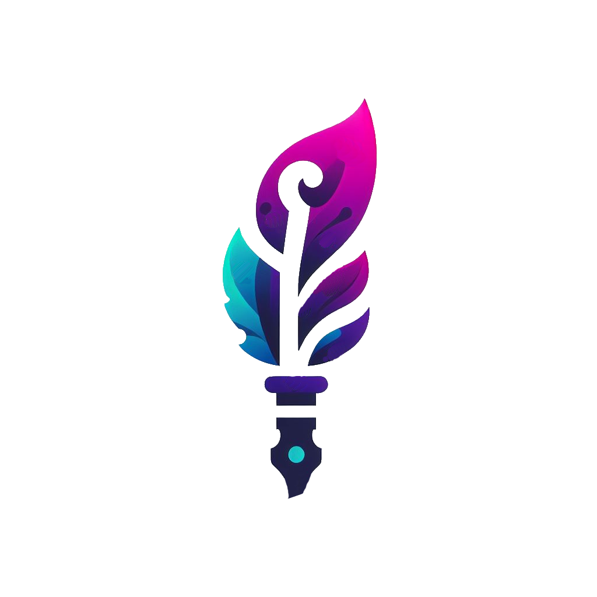

 
# Robo Khatt (خط)
Where Tradition Meets Technology

Robo Khatt is an innovative project that leverages advanced diffusion models to generate high-quality Arabic calligraphy. By combining the artistry of traditional calligraphy with the power of artificial intelligence, RoboKhatt aims to provide beautifully rendered text that can be used in various applications.

The project is called "RoboKhatt" to reflect its focus on text rendering and calligraphy and AI Automation. The name combines "Robo" for AI / robotics and "Khatt" the Arabic (خط) word for calligraphy

## Problem Statement
In traditional text rendering, we often encounter challenges with laying out text properly or finding suitable substitutions for certain characters or words. As a fun and ambitious solution, I propose training a diffusion model to become a calligrapher! However, recognizing the enormity of this task, I plan to take an incremental approach.

## Approach
My approach involves training a model to render small sentences or even single words initially. At runtime, the rendered image will be used to feed the diffusion model. This approach allows us to start with simpler tasks and gradually scale up to more complex text generation.

## Additional Notes
I'm excited about the potential of this project to merge the elegance of Arabic calligraphy with the power of modern AI. Any feedback or contributions to further enhance RoboKhatt are welcome!
